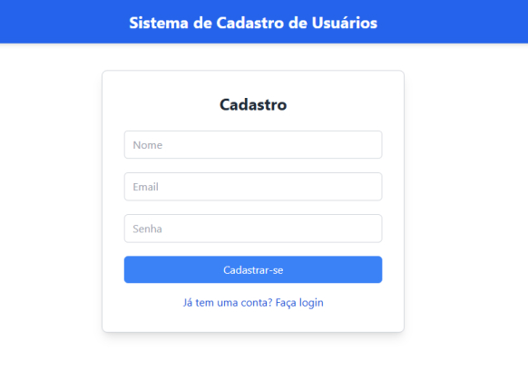

# Sistema de Cadastro de Usuários

Este projeto é uma aplicação completa de cadastro de usuários com autenticação. Usuários podem se registrar, fazer login e acessar uma área privada com listagem de dados. O back-end foi desenvolvido com Node.js e MongoDB, e o front-end com React e Tailwind CSS.

## Tabela de Conteúdos

- [Sobre o Projeto](#sobre-o-projeto)
- [Tecnologias Utilizadas](#tecnologias-utilizadas)
- [Funcionalidades](#funcionalidades)
- [Instalação e Uso](#instalação-e-uso)
- [Estrutura de Pastas](#estrutura-de-pastas)
- [Endpoints da API](#endpoints-da-api)

## Sobre o Projeto

O **Sistema de Cadastro de Usuários** permite que usuários se registrem, façam login e acessem uma área privada com listagem de dados. O sistema utiliza autenticação JWT para segurança, protegendo o acesso a páginas restritas.

## Tecnologias Utilizadas

### Back-end

- **Node.js**: Ambiente de execução JavaScript no servidor.
- **Express**: Framework para criação de API.
- **Prisma**: ORM para integração com MongoDB.
- **MongoDB**: Banco de dados para armazenamento de dados.
- **JWT**: Autenticação baseada em JSON Web Tokens.
- **Bcrypt**: Criptografia para senhas.
- **Cors**: Configuração de CORS para controle de acesso.

### Front-end

- **React**: Biblioteca para construção de interfaces de usuário.
- **Tailwind CSS**: Biblioteca de estilos para design responsivo.
- **Axios**: Cliente HTTP para consumo da API.

## Funcionalidades

### Back-end

- **Cadastro de Usuário**: Registro de novos usuários no sistema com criptografia de senha.
- **Autenticação**: Autenticação de usuários com JWT para acesso a áreas protegidas.
- **Paginação de Listagem**: Endpoint seguro para listagem de dados acessível apenas após login.

### Front-end

- **Página de Cadastro**: Interface para o registro de novos usuários.
- **Página de Login**: Interface para autenticação de usuários existentes.
- **Página de Listagem**: Área privada com dados acessível apenas para usuários autenticados.

## Instalação e Uso

### Pré-requisitos

- Node.js e npm instalados
- MongoDB configurado

### Endpoints da API

- POST /auth/register: Cadastro de um novo usuário.
- POST /auth/login: Autenticação do usuário com JWT.
- GET /private/data: Endpoint seguro, acessível apenas por usuários autenticados (página de listagem).

### Clone o repositório

```bash
git clone https://github.com/seu-usuario/sistema-cadastro-usuarios.git
cd sistema-cadastro-usuarios

```

# User Registration System

This project is a complete user registration application with authentication. Users can register, log in, and access a private area with a data listing. The back end was developed with Node.js and MongoDB, and the front end with React and Tailwind CSS.

## Table of Contents

- [About the Project](#about-the-project)
- [Technologies Used](#technologies-used)
- [Features](#features)
- [Installation and Usage](#installation-and-usage)
- [Folder Structure](#folder-structure)
- [API Endpoints](#api-endpoints)

## About the Project

The **User Registration System** allows users to register, log in, and access a private area with data listing. The system uses JWT authentication for security, protecting access to restricted pages.

## Technologies Used

### Back end

- **Node.js**: JavaScript runtime environment on the server.
- **Express**: Framework for API creation.
- **Prisma**: ORM for integration with MongoDB.
- **MongoDB**: Database for data storage.
- **JWT**: Authentication based on JSON Web Tokens.
- **Bcrypt**: Password encryption.
- **Cors**: CORS configuration for access control.

### Front end

- **React**: Library for building user interfaces.
- **Tailwind CSS**: Style library for responsive design.
- **Axios**: HTTP client for API consumption.

## Features

### Back end

- **User Registration**: Registers new users in the system with password encryption.
- **Authentication**: Authenticates users with JWT for access to protected areas.
- **Data Listing Pagination**: Secure endpoint for data listing, accessible only after login.

### Front end

- **Registration Page**: Interface for registering new users.
- **Login Page**: Interface for authenticating existing users.
- **Data Listing Page**: Private area with data accessible only to authenticated users.

## Installation and Usage

### Prerequisites

- Node.js and npm installed
- MongoDB configured

### API Endpoints

- POST /auth/register: Register a new user.
- POST /auth/login: Authenticate the user with JWT.
- GET /private/data: Secure endpoint, accessible only by authenticated users (listing page).

### Clone the Repository

```bash
git clone https://github.com/your-username/user-registration-system.git
cd user-registration-system
```
